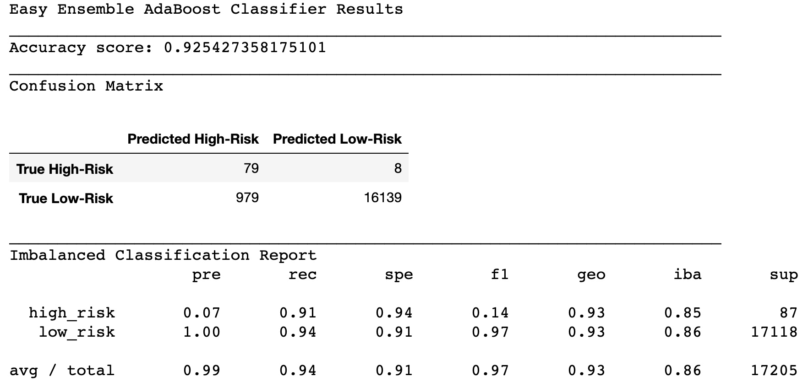

# Credit_Risk_Analysis
 ## Overview 

The main purpose of our analysis is to employ machine learning techniques to a credit card dataset from LendingClub(a peer-to-peer lending services company). Credit risk is an unbalanced classification problem because good loans often outnumber risky loans. Therefore, we have to employ different techniques to train and evaluate models with unbalanced classes. We have used imbalanced-learn and scikit-learn libraries to build and evaluate models using resampling.

**Steps to follow:**

* Oversample the data using the RandomOverSampler and SMOTE algorithms.
* Undersample the data using the ClusterCentroids algorithm.
* Use a combinatorial approach of over-and undersampling using the SMOTEENN algorithm.
* Compare two new machine learning models that reduce bias, BalancedRandomForestClassifier, and EasyEnsembleClassifier, to predict credit risk.
* Finally, we'll evaluate the performance of these models and make a written recommendation on whether they should be used to predict credit risk.

## Results

#### Oversampling 

**1- Naive Random Oversampling**

Confusion matrix breakdown

True Positive (TP) = 54
False Positive (FP) = 6215
False Negative (FN) = 33
True Negative (TN) = 10903

Precision is the measure of how reliable a positive classification is. This model classified 6269 cases as high risk when in reality only 54 were TP. That is why the precision for high risk is very low, 0.01, respectively. 

Recall or Sensitivity is the ability of the classifier to find all the positive samples. It can be determined by the ratio: TP/(TP + FN). In our case, 87 cases were classified correctly. Recall= 0.62.

Balanced Accuracy Score is defined as the average of recall obtained in each class. We can see our balance accuracy scored on the image above Accuracy score= 0.629

F1 score is a weighted average of the true positive rate (recall) and precision. Our F1= 0.2. Which is significantly low. We want this value to be 1 or close to 1.

**2- SMOTE Oversampling**

Confusion matrix breakdown

True Positive (TP) = 50
False Positive (FP) = 5662
False Negative (FN) = 37
True Negative (TN) = 11456

Precision= 0.01 
Recall = 0.57
Balanced Accuracy = 0.62
F1= 0.02

This model did not perform better than the previous "Naive Random Oversampling", the recall values are lower. 

#### Undersampling

**3- ClusterCentroids**

Confusion matrix breakdown

True Positive (TP) = 48
False Positive (FP) = 9273
False Negative (FN) = 39
True Negative (TN) = 7845

Precision= 0.01 
Recall = 0.57
Balanced Accuracy = 0.51
F1= 0.01

This model did not perform better than the two previous models, the recall and F1 values are lower. 

#### Combination (Over and Under) Sampling

**4- SMOTEENN**

Confusion matrix breakdown

True Positive (TP) = 55
False Positive (FP) = 6996
False Negative (FN) = 32
True Negative (TN) = 10122

Precision= 0.01 
Recall = 0.63
Balanced Accuracy = 0.61
F1= 0.02

Out of all the previous models, SMOTEENN performed the best. 

#### Ensemble Learners

**5- Balanced Random Forest Classifier**

Confusion matrix breakdown

True Positive (TP) = 58
False Positive (FP) = 1560
False Negative (FN) = 29
True Negative (TN) = 15558

Precision= 0.04
Recall = 0.67
Balanced Accuracy = 0.79
F1= 0.07

**6- Easy Ensemble AdaBoost Classifier**

True Positive (TP) = 58
False Positive (FP) = 1560
False Negative (FN) = 29
True Negative (TN) = 15558

Precision= 0.07
Recall = 0.91
Balanced Accuracy = 0.93
F1= 0.14

## Summary

We can observe that out of the three resampling methos,  SMOTEENN did the best job at classifyng with a Precision= 0.01, Recall = 0.63, Balanced Accuracy = 0.61, F1= 0.02. However, both emsemble methods outperformed every resampling method, especially the AdaBoost Classifier, with a Precision= 0.07, Recall = 0.91, Balanced Accuracy = 0.93, and F1= 0.14. 

#### Reccomendations

Even though the AdaBoost classifier showed big improvements, it is still not good enough to predict credit risk accurately. The precision is only 8%. A low precision is indicative of a large number of false positives- of the 1,058 applications predicted to be high-risk, 79 were actually high risk, and 979 low-risk. In contrast, sensitivity is pretty good (91%) which is indicative of little false negatives- in our case only 8. 

